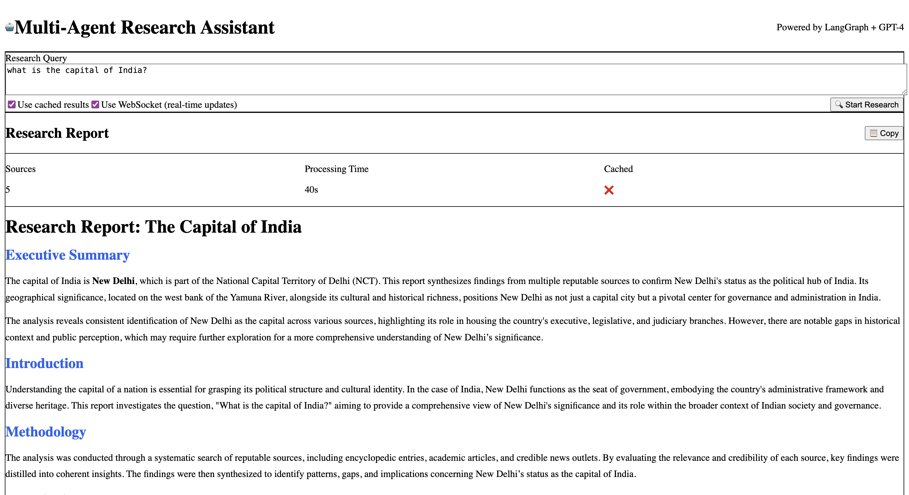

# 🤖 Multi-Agent Research Assistant

An AI-powered research system that automates complex research workflows using specialized agents working together. Built with LangGraph, FastAPI, and Vue.js.


## 📸 Screenshot



## 🌟 Features

- **Three Specialized AI Agents**:
  - **Researcher Agent** 🔍: Searches the web using Tavily API for relevant, up-to-date information
  - **Analyzer Agent** 🧠: Synthesizes findings and extracts key insights using GPT-4
  - **Writer Agent** ✍️: Creates professional, structured research reports

- **Real-time Updates**: WebSocket support for live progress tracking
- **Smart Caching**: Intelligent result caching to save time and API costs
- **Professional Reports**: Generates comprehensive reports with executive summaries, key findings, and recommendations
- **Modern UI**: Clean, responsive interface built with Vue.js and Tailwind CSS

## 🏗️ Architecture

```
User Query (Vue.js Frontend)
     ↓
FastAPI Backend (REST + WebSocket)
     ↓
LangGraph Orchestrator
     ↓
┌─────────┼─────────┐
↓         ↓         ↓
Researcher → Analyzer → Writer
(Tavily)   (GPT-4)   (GPT-4)
     ↓
Final Report → Frontend
```

## 🚀 Tech Stack

### Backend
- **Python 3.11+**
- **FastAPI** - High-performance web framework
- **LangGraph** - Multi-agent orchestration
- **OpenAI GPT-4** - Language model for analysis and writing
- **Tavily API** - Web search capabilities
- **WebSocket** - Real-time communication

### Frontend
- **Vue.js 3** - Progressive JavaScript framework
- **TypeScript** - Type safety
- **Tailwind CSS** - Utility-first CSS framework
- **Axios** - HTTP client
- **Marked** - Markdown rendering

## 📋 Prerequisites

- Python 3.11+
- Node.js 20.16+
- OpenAI API key
- Tavily API key (free tier available)

## 🛠️ Installation

### 1. Clone the Repository

```bash
git clone https://github.com/yourusername/multi-agent-research.git
cd multi-agent-research
```

### 2. Backend Setup

```bash
# Navigate to backend
cd backend

# Create virtual environment
python -m venv venv

# Activate virtual environment
# On macOS/Linux:
source venv/bin/activate
# On Windows:
# venv\Scripts\activate

# Install dependencies
pip install -r requirements.txt

# Create .env file
cp .env.example .env

# Edit .env and add your API keys:
# OPENAI_API_KEY=your_openai_key_here
# TAVILY_API_KEY=your_tavily_key_here
```

### 3. Frontend Setup

```bash
# Navigate to frontend
cd ../frontend

# Install dependencies
npm install

# Create .env file
echo "VITE_API_BASE_URL=http://localhost:8000" > .env
echo "VITE_WS_URL=ws://localhost:8000/ws" >> .env
```

## 🚀 Running the Application

### Start Backend Server

```bash
# Terminal 1
cd backend
source venv/bin/activate  # Activate virtual environment
python main.py

# Server will run on http://localhost:8000
# API documentation available at http://localhost:8000/docs
```

### Start Frontend Development Server

```bash
# Terminal 2
cd frontend
npm run dev

# Frontend will run on http://localhost:5173
```

## 🧪 Testing

### Test Backend

```bash
cd backend
python test_api.py
```

This will test:
- Health check endpoint
- Research API endpoint
- WebSocket connection
- Cache functionality
- Error handling

### Test Complete System

```bash
cd backend
python test_complete_system.py
```

## 📝 Usage

1. Open http://localhost:5173 in your browser
2. Enter a research query (e.g., "What are the latest advances in quantum computing?")
3. Optional: Enable WebSocket for real-time updates
4. Click "Start Research"
5. Watch as the three agents work together to generate your report
6. Copy or download the final report

## 🔧 Configuration

### Backend Configuration (`backend/config/settings.py`)

- `OPENAI_MODEL`: GPT model to use (default: "gpt-4o-mini")
- `TEMPERATURE`: Creativity level (0.0-1.0, default: 0.7)
- `DEBUG`: Enable debug mode

### Frontend Configuration (`frontend/.env`)

- `VITE_API_BASE_URL`: Backend API URL
- `VITE_WS_URL`: WebSocket URL

## 📊 API Endpoints

| Endpoint | Method | Description |
|----------|--------|-------------|
| `/` | GET | API information |
| `/health` | GET | Health check |
| `/api/research` | POST | Submit research query |
| `/api/cache/stats` | GET | Cache statistics |
| `/ws` | WebSocket | Real-time updates |

## 💰 Cost Estimation

- **OpenAI GPT-4o-mini**: ~$0.15 per 1M input tokens
- **Tavily API**: 1000 searches/month free tier
- **Estimated cost**: < $0.01 per research query

## 🚢 Deployment

### Frontend (Vercel)

```bash
cd frontend
vercel
```

### Backend (Railway)

```bash
cd backend
railway up
```

Don't forget to update environment variables in production!

## 🗂️ Project Structure

```
multi-agent-research/
├── backend/
│   ├── agents/
│   │   ├── researcher.py    # Tavily search agent
│   │   ├── analyzer.py      # GPT-4 analysis agent
│   │   └── writer.py        # Report writing agent
│   ├── workflow/
│   │   └── research_graph.py # LangGraph orchestration
│   ├── config/
│   │   └── settings.py      # Configuration
│   ├── main.py              # FastAPI server
│   └── requirements.txt
├── frontend/
│   ├── src/
│   │   ├── components/
│   │   │   └── ResearchApp.vue
│   │   ├── App.vue
│   │   └── main.ts
│   ├── package.json
│   └── vite.config.ts
└── README.md
```

## 🤝 Contributing

Contributions are welcome! Please feel free to submit a Pull Request.


## 🙏 Acknowledgments

- OpenAI for GPT-4 API
- Tavily for search API
- LangChain/LangGraph for agent orchestration framework
- FastAPI for the excellent web framework
- Vue.js team for the frontend framework

